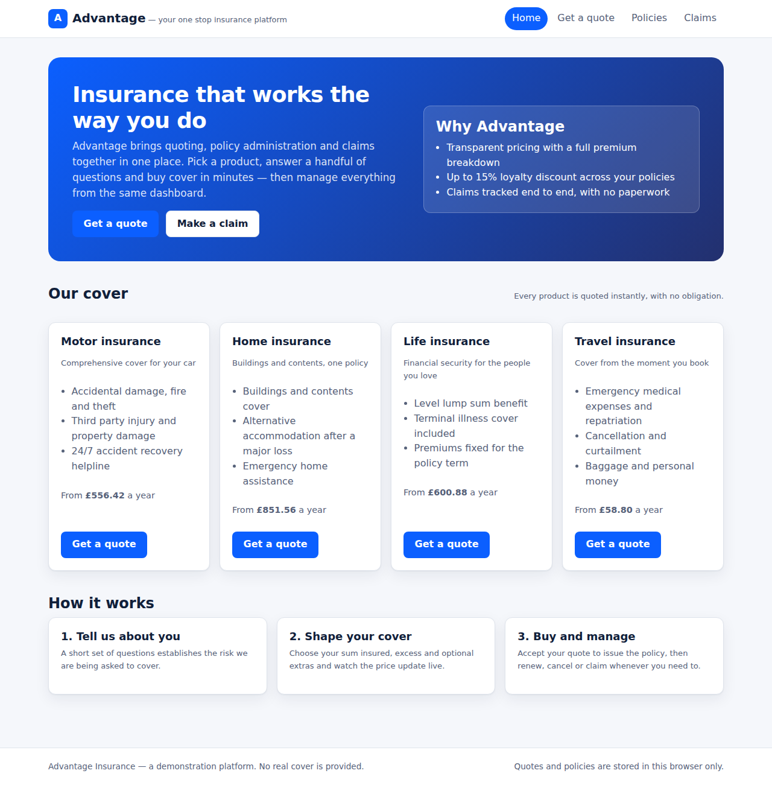

# Advantage

Your one stop Insurance platform.

Advantage is a generic insurance platform that covers the full customer journey in one
application: browse the product catalogue, get an instant quote, buy the policy, manage it and
claim against it.

**Live site:** <https://charles2ke.github.io/Advantage/>



## Features

- **Product catalogue** — motor, home, life and travel cover, each with its own rating factors,
  optional extras and excess options (`src/domain/catalog.ts`).
- **Quoting** — a three step wizard collects the applicant details, the cover options and the
  answers to the risk questions, and prices the risk live as you type
  (`src/components/QuoteWizard.tsx`).
- **Rating engine** — a deterministic pricing engine that builds the premium from the base rate,
  age and risk loadings, optional coverages, excess, loyalty discount and insurance premium tax,
  and returns a full breakdown (`src/domain/rating.ts`).
- **Policy administration** — quotes are saved for 30 days, accepted quotes are issued as 12 month
  policies, and policies can be renewed in the 30 days before expiry or cancelled
  (`src/domain/policies.ts`).
- **Claims** — claims are validated against the policy (cover period, sum insured), given a
  reference and tracked through submitted → in review → approved/declined → settled, with the
  settlement calculated net of the policy excess (`src/domain/claims.ts`).
- **Admin portal** — a setup area at `#/admin` where the platform is named, products are put on or
  taken off sale, the pricing rules (tax, instalment loading, loyalty discount, quote validity) are
  tuned and the stored data can be cleared (`src/pages/AdminPage.tsx`, `src/domain/settings.ts`).
- **Persistence** — quotes, policies and claims are stored in the browser's local storage, so the
  platform runs as a static site with no backend (`src/state/storage.ts`).

## Getting started

```bash
npm install
npm run dev
```

The app is served on <http://localhost:5173>.

## Scripts

| Script | Description |
| --- | --- |
| `npm run dev` | Start the development server |
| `npm run build` | Type check and build the production bundle into `dist/` |
| `npm run preview` | Serve the production build |
| `npm run lint` | Lint the source with oxlint |
| `npm test` | Run the unit and component tests with Vitest |
| `npm run test:e2e` | Run the Playwright end to end tests (builds and previews the app) |

Playwright needs its browser once per machine: `npx playwright install --with-deps chromium`.

## Deployment

The app is a static site (hash routing, browser local storage) and is published to GitHub Pages by
the `.github/workflows/deploy.yml` workflow on every push to `main`. To enable it, set
**Settings → Pages → Build and deployment → Source** to **GitHub Actions**.

The workflow builds with `BASE_PATH=/<repository name>/` so the assets resolve under the project
page URL. Locally `npm run build` defaults to a base of `/`; set `BASE_PATH` yourself to reproduce
the deployed build:

```bash
BASE_PATH=/Advantage/ npm run build && npm run preview
```

## Project structure

```
src/domain      pure business logic: catalogue, rating, policies, claims, settings, formatting
src/state       reducer, React context provider and local storage persistence
src/components  reusable UI: quote wizard, premium summary, product card, status badge
src/pages       home, quote, policies, claims and admin pages
src/router.ts   minimal hash router so the app deploys as static files
tests           Vitest unit and component tests
e2e             Playwright end to end tests (screenshots are written to docs/screenshots)
```

## How the premium is calculated

1. **Base premium** — the product's flat premium plus a rate per 1,000 of the sum insured.
2. **Risk adjustment** — the age band multiplier and every risk answer multiplier applied to the
   base premium.
3. **Optional cover** — each selected extra adds a percentage of the risk adjusted premium.
4. **Excess** — a lower excess loads the premium, a higher excess discounts it.
5. **Loyalty discount** — 5% per policy already held, capped at 15%.
6. **Minimum premium, tax and instalments** — the net premium never falls below the product
   minimum, insurance premium tax of 12% is added, and paying monthly carries a 5% loading.

The tax rate, instalment loading, loyalty discount and quote validity are defaults that an
administrator can change in the admin portal; new quotes are rated with the saved settings.

## Screenshots

| Journey | Screenshot |
| --- | --- |
| Quote details | [02-quote-details.png](docs/screenshots/02-quote-details.png) |
| Quote result | [03-quote-result.png](docs/screenshots/03-quote-result.png) |
| Policies | [04-policies.png](docs/screenshots/04-policies.png) |
| Claim submitted | [05-claim-submitted.png](docs/screenshots/05-claim-submitted.png) |
| Claim settled | [06-claim-settled.png](docs/screenshots/06-claim-settled.png) |
| Admin portal | [07-admin.png](docs/screenshots/07-admin.png) |

Advantage is a demonstration platform: no real insurance cover is provided and all data stays in
your browser.
