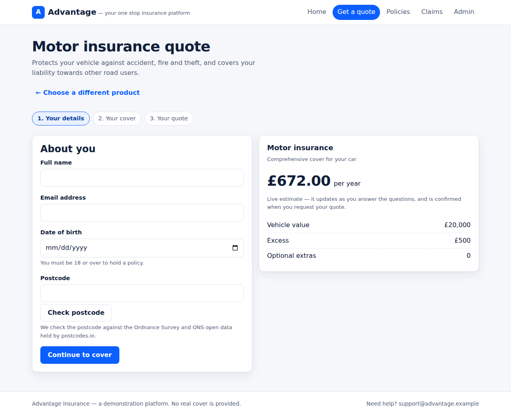
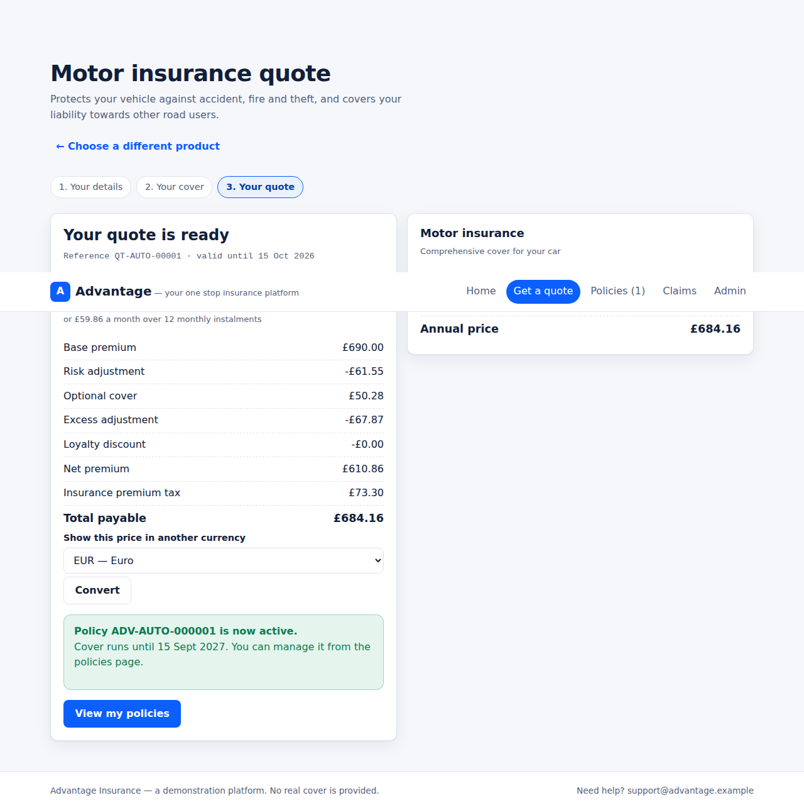
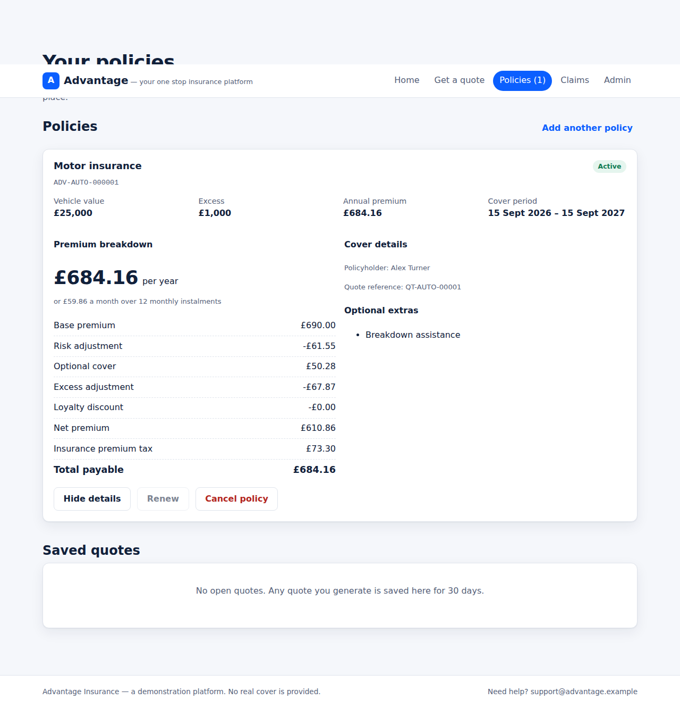
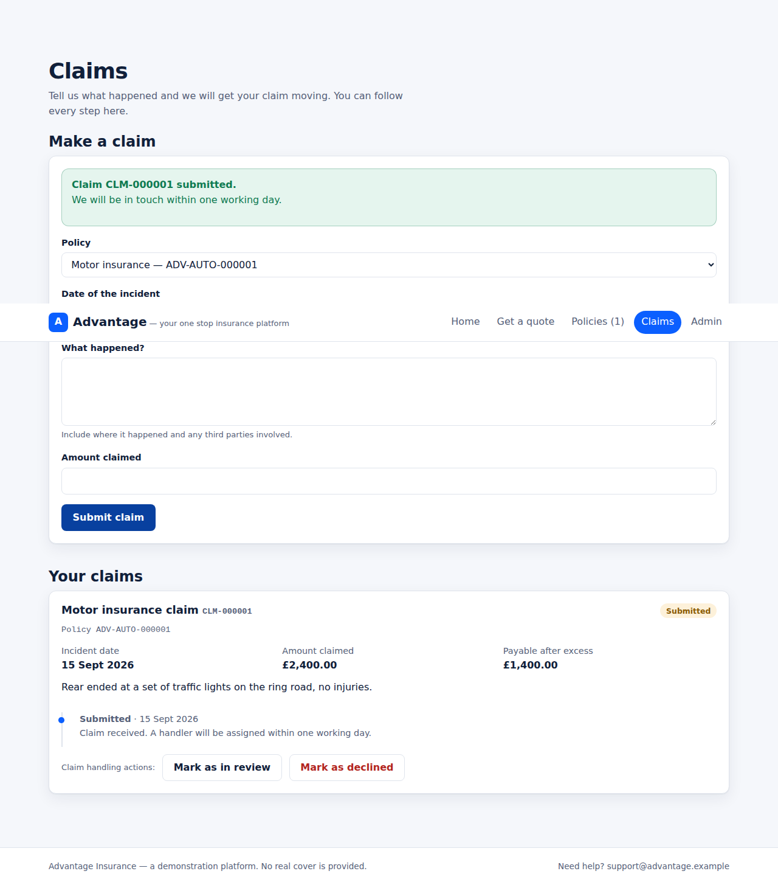
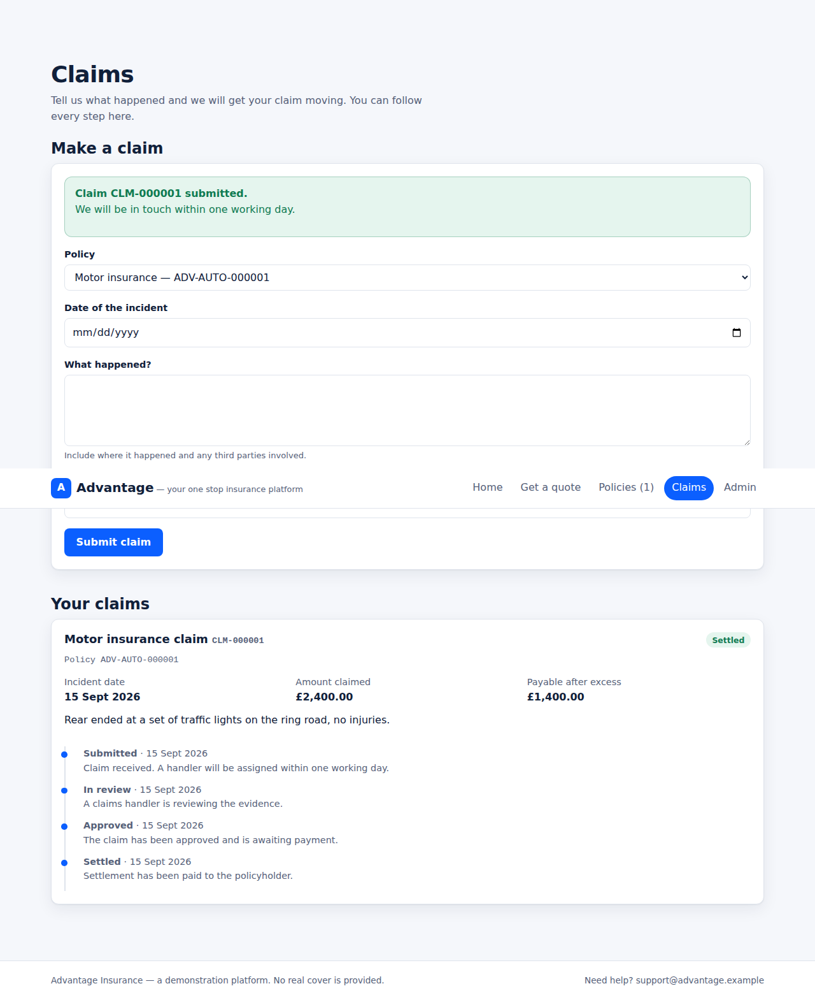
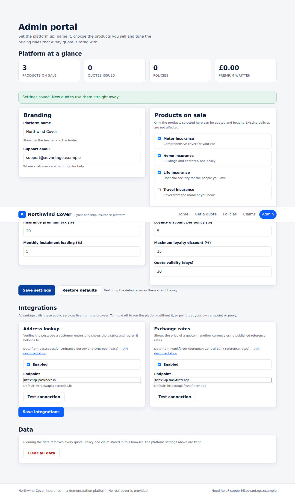
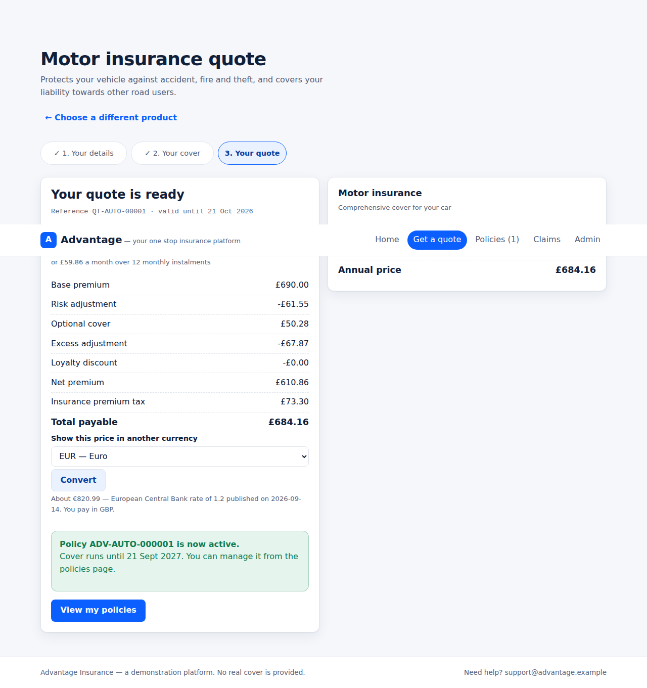
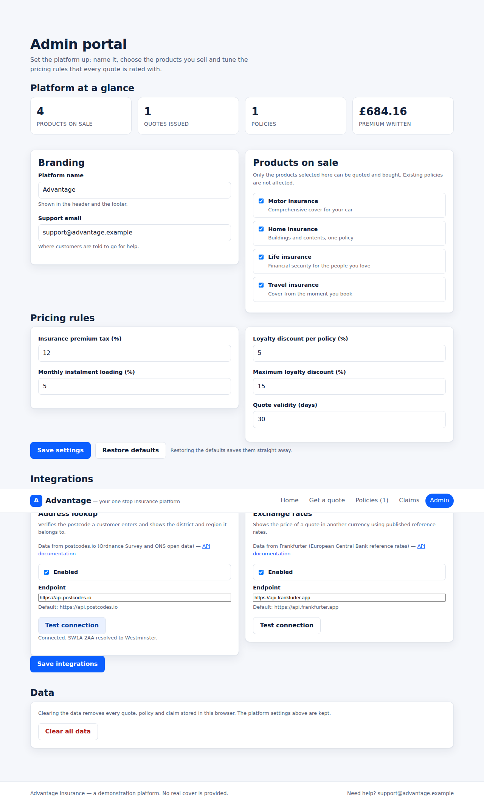

# Advantage

> Your one stop insurance platform — quote, buy, manage and claim, all in the browser.

[](https://github.com/charles2ke/Advantage/actions/workflows/deploy.yml)
[](LICENSE)
[](https://react.dev/)
[](https://www.typescriptlang.org/)
[](https://vite.dev/)

Advantage is a generic insurance platform that covers the full customer journey in one
application: browse the product catalogue, get an instant quote, buy the policy, manage it and
claim against it. It runs entirely in the browser — no backend, no database and no API keys.

**Live site:** <https://charles2ke.github.io/Advantage/>


## Contents

- [Features](#features)
- [Quick start](#quick-start)
- [Scripts](#scripts)
- [Testing](#testing)
- [Project structure](#project-structure)
- [Architecture](#architecture)
- [Integrations](#integrations)
- [How the premium is calculated](#how-the-premium-is-calculated)
- [Deployment](#deployment)
- [Screenshots](#screenshots)
- [Contributing](#contributing)
- [Security](#security)
- [License](#license)

## Features

- **Product catalogue** — motor, home, life and travel cover, each with its own rating factors,
  optional extras and excess options (`src/domain/catalog.ts`).
- **Quoting** — a three step wizard collects the applicant details, the cover options and the
  answers to the risk questions, and prices the risk live as you type
  (`src/components/QuoteWizard.tsx`).
- **Rating engine** — a deterministic pricing engine that builds the premium from the base rate,
  age and risk loadings, optional coverages, excess, loyalty discount and insurance premium tax,
  and returns a full breakdown (`src/domain/rating.ts`).
- **Policy administration** — quotes are saved for 30 days, accepted quotes are issued as 12 month
  policies, and policies can be renewed in the 30 days before expiry or cancelled
  (`src/domain/policies.ts`).
- **Claims** — claims are validated against the policy (cover period, sum insured), given a
  reference and tracked through submitted → in review → approved/declined → settled, with the
  settlement calculated net of the policy excess (`src/domain/claims.ts`).
- **Admin portal** — a setup area at `#/admin` where the platform is named, products are put on or
  taken off sale, the pricing rules (tax, instalment loading, loyalty discount, quote validity) are
  tuned and the stored data can be cleared (`src/pages/AdminPage.tsx`, `src/domain/settings.ts`).
- **Real world integrations** — the platform calls live public services from the browser: postcodes
  are verified against postcodes.io and quote prices can be shown in another currency using the
  European Central Bank reference rates published by Frankfurter (`src/integrations/`).
- **Persistence** — quotes, policies and claims are stored in the browser's local storage, so the
  platform runs as a static site with no backend (`src/state/storage.ts`).

## Quick start

**Prerequisites:** [Node.js](https://nodejs.org/) 24 (the version used in CI) and npm.

```bash
git clone https://github.com/charles2ke/Advantage.git
cd Advantage
npm install
npm run dev
```

The app is served on <http://localhost:5173>.

First run through the app:

1. Open the home page and pick a product.
2. Complete the three step quote wizard and review the premium breakdown.
3. Accept the quote to issue a policy, then manage or renew it on the **Policies** page.
4. Submit a claim against the policy on the **Claims** page.
5. Visit `#/admin` to rename the platform, change the pricing rules or clear the stored data.

All data lives in your browser's local storage; clearing site data resets the platform.

## Scripts

| Script | Description |
| --- | --- |
| `npm run dev` | Start the development server |
| `npm run build` | Type check and build the production bundle into `dist/` |
| `npm run preview` | Serve the production build |
| `npm run lint` | Lint the source with oxlint |
| `npm test` | Run the unit and component tests with Vitest |
| `npm run test:watch` | Run Vitest in watch mode |
| `npm run test:e2e` | Run the Playwright end to end tests (builds and previews the app) |

## Testing

- **Unit and component tests** (`tests/`) run on Vitest with Testing Library and jsdom. They cover
  the rating engine, policy and claim lifecycles, settings, the state reducer, the integration
  clients and the pages that use them.
- **End to end tests** (`e2e/advantage.spec.ts`) run on Playwright against the production build and
  walk the full journey: quote → policy → claim → admin. The screenshots in `docs/screenshots` are
  produced by this suite, so they stay in step with the UI.

Playwright needs its browser once per machine:

```bash
npx playwright install --with-deps chromium
```

CI runs `npm run lint`, `npm test` and `npm run build` on every push to `main` before deploying.

## Project structure

```
src/domain       pure business logic: catalogue, rating, policies, claims, settings, formatting
src/integrations clients for the external services the platform calls
src/state        reducer, React context provider and local storage persistence
src/components   reusable UI: quote wizard, premium summary, product card, status badge
src/pages        home, quote, policies, claims and admin pages
src/router.ts    minimal hash router so the app deploys as static files
tests            Vitest unit and component tests
e2e              Playwright end to end tests (screenshots are written to docs/screenshots)
```

## Architecture

- **Pure domain layer.** Everything in `src/domain` is side effect free: ids and timestamps are
  passed in by the caller rather than generated inside, so quoting, issuing, renewing and claiming
  are all deterministic and easy to test.
- **Single reducer.** Every state change goes through the pure reducer in `src/state/appReducer.ts`;
  `src/state/AppProvider.tsx` wires it to React context and mirrors the state into local storage.
- **Static by design.** A minimal hash router (`src/router.ts`) keeps the app deployable as plain
  files on any static host, including GitHub Pages.
- **Isolated integrations.** External calls are confined to `src/integrations` behind a single
  result contract, so the rest of the app never deals with network failures directly.

## Integrations

Advantage talks to real, keyless public APIs so the platform works end to end as a static site with
no backend and no secrets to manage.

| Integration | Service | Used for |
| --- | --- | --- |
| Address lookup | [postcodes.io](https://postcodes.io/docs) (Ordnance Survey and ONS open data) | Verifying the postcode in the quote wizard and showing its district and region |
| Exchange rates | [Frankfurter](https://www.frankfurter.app/docs) (European Central Bank reference rates) | Showing the price of a quote in another currency |

Each integration lives in `src/integrations` behind a small contract: the client takes the request
and an optional endpoint, timeout, abort signal and `fetch` implementation, and always resolves to
`{ ok: true, data }` or `{ ok: false, error }`. Network errors, timeouts, error statuses and
unexpected payloads are turned into a readable message, so an outage never blocks a quote, and the
tests stub `fetch` instead of touching the network.

Administrators manage them under **Integrations** in the admin portal: each one can be turned off,
pointed at another https endpoint (for example a proxy of your own) and tested with a live
connection check. The configuration is validated and persisted with the rest of the settings.

Adding another integration means adding its client under `src/integrations` and registering it in
`src/integrations/catalog.ts`; the settings, persistence and admin portal pick it up from there.

## How the premium is calculated

1. **Base premium** — the product's flat premium plus a rate per 1,000 of the sum insured.
2. **Risk adjustment** — the age band multiplier and every risk answer multiplier applied to the
   base premium.
3. **Optional cover** — each selected extra adds a percentage of the risk adjusted premium.
4. **Excess** — a lower excess loads the premium, a higher excess discounts it.
5. **Loyalty discount** — 5% per policy already held, capped at 15%.
6. **Minimum premium, tax and instalments** — the net premium never falls below the product
   minimum, insurance premium tax of 12% is added, and paying monthly carries a 5% loading.

The tax rate, instalment loading, loyalty discount and quote validity are defaults that an
administrator can change in the admin portal; new quotes are rated with the saved settings.

## Deployment

The app is a static site (hash routing, browser local storage) and is published to GitHub Pages by
the `.github/workflows/deploy.yml` workflow on every push to `main`. To enable it, set
**Settings → Pages → Build and deployment → Source** to **GitHub Actions**.

The workflow builds with `BASE_PATH=/<repository name>/` so the assets resolve under the project
page URL. Locally `npm run build` defaults to a base of `/`; set `BASE_PATH` yourself to reproduce
the deployed build:

```bash
BASE_PATH=/Advantage/ npm run build && npm run preview
```

Any other static host works too: build the app and serve the contents of `dist/`.

## Screenshots

| Quote details | Quote result |
| --- | --- |
|  |  |

| Policies | Claim submitted |
| --- | --- |
|  |  |

| Claim settled | Admin portal |
| --- | --- |
|  |  |

| Quote with a converted price | Integrations in the admin portal |
| --- | --- |
|  |  |

## Contributing

Issues and pull requests are welcome. Before opening a pull request:

```bash
npm run lint
npm test
npm run build
```

Keep business logic in `src/domain` pure, route state changes through `src/state/appReducer.ts`,
and add tests alongside the existing suites in `tests/`.

## Security

Advantage stores everything in your browser and calls only public, keyless APIs, so there are no
credentials to manage. To report a vulnerability, see [SECURITY.md](SECURITY.md).

## License

Released under the [GNU Affero General Public License v3.0](LICENSE).

---

Advantage is a demonstration platform: no real insurance cover is provided and all data stays in
your browser.
